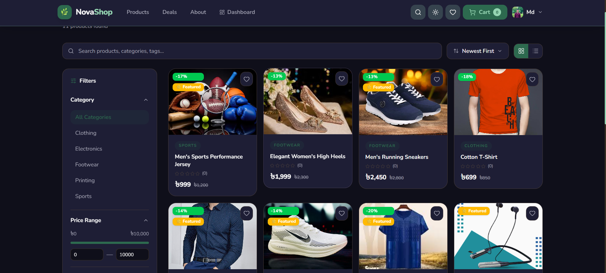
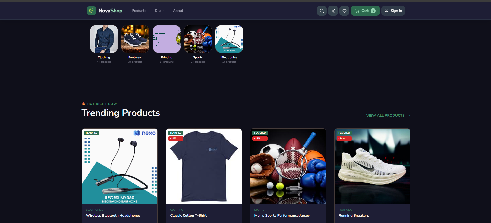
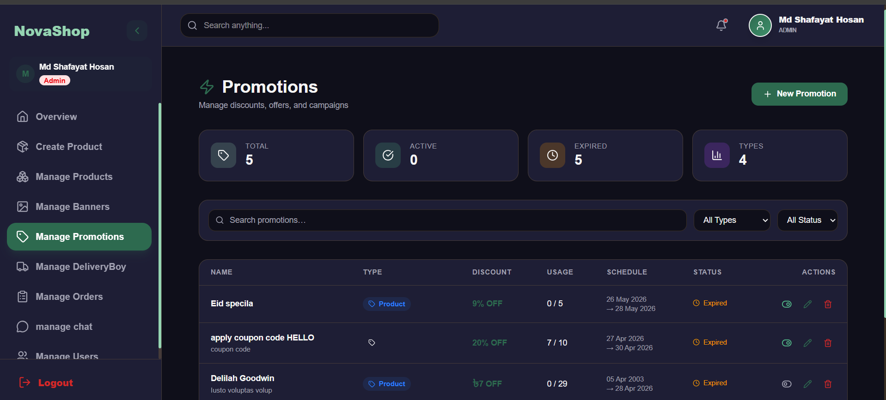

<div align="center">



# 🛍️ NovaShop

### Modern Multi-Role E-commerce Platform

<p>
<a href="https://novashop-bd.vercel.app">

</a>

<a href="https://github.com/shafayat783593">

</a>
</p>

<p>


</p>

</div>

---

# 🌍 Live Demo

### 🔗 https://novashop-bd.vercel.app/

---

# 📖 Overview

NovaShop is a modern full-stack multi-role e-commerce platform built with **Next.js**, **Node.js**, **Express.js**, and **MongoDB**.

It provides customers with a seamless online shopping experience while giving administrators complete control over products, orders, promotions, and users through a powerful dashboard.

The application also includes secure authentication, real-time chat, multiple payment gateways, Redis caching, and production-ready architecture.

---

# ✨ Key Features

## 🔐 Authentication

- Email & Password Authentication
- Google OAuth Login
- JWT Authentication
- Secure Cookies
- CSRF Protection

---

## 🛍 Shopping

- Browse Products
- Product Search
- Category Filter
- Product Details
- Wishlist
- Shopping Cart

---

## 💳 Payments

- Stripe Payment
- SSLCommerz Payment
- bKash Payment
- Secure Checkout
- Order Confirmation

---

## 💬 Real-time Communication

- Customer ↔ Admin Chat
- Socket.IO Integration
- Instant Messaging

---

## ⭐ Reviews

- Verified Purchase Reviews
- Rating System

---

## 🏷 Promotions

- Dynamic Discounts
- Coupon Support
- Promotional Banner

---

## ⚡ Performance

- Redis Cache
- Optimized Queries
- Fast Loading

---

# 👥 User Roles

## 🛒 Customer

Customers can:

- Register/Login
- Browse Products
- Search Products
- Add to Cart
- Wishlist
- Place Orders
- Make Payments
- Track Orders
- Write Reviews
- Chat with Admin

---

## 👨‍💼 Admin

Admins can:

- Dashboard Analytics
- Manage Products
- Manage Categories
- Manage Orders
- Manage Customers
- Manage Promotions
- Reply Customer Chats
- Manage Reviews

---

# 🛠 Tech Stack

| Layer | Technology |
|---------|------------|
| Frontend | Next.js, React, Tailwind CSS |
| Backend | Node.js, Express.js |
| Database | MongoDB, Mongoose |
| Cache | Redis |
| Authentication | Passport.js, JWT, Google OAuth |
| Payment | Stripe, SSLCommerz, bKash |
| Real-time | Socket.IO |
| Email | Resend |
| Deployment | Vercel & Render |

---

# 📦 Main Dependencies

### Frontend

- Next.js
- React
- Tailwind CSS
- Axios
- React Query
- React Hook Form
- Zod
- Framer Motion
- React Hot Toast

### Backend

- Express.js
- Mongoose
- Redis
- Passport.js
- JWT
- Socket.IO
- Stripe
- SSLCommerz
- Resend
- Cloudinary
- Multer

---

# 📸 Screenshots

## 🏠 Home Page



---

## 💳 Checkout


---

## 👨‍💼 Dashboard



---

# ⚙️ Installation

Clone the repository

```bash
git clone https://github.com/shafayat783593/novashop.git
```

Go to project

```bash
cd novashop
```

Install dependencies

```bash
npm install
```

Run development server

```bash
npm run dev
```

---

# 🔑 Environment Variables

```env
MONGODB_URI=

REDIS_URL=

JWT_SECRET=

GOOGLE_CLIENT_ID=

GOOGLE_CLIENT_SECRET=

STRIPE_SECRET_KEY=

STRIPE_WEBHOOK_SECRET=

SSLCOMMERZ_STORE_ID=

SSLCOMMERZ_STORE_PASSWORD=

BKASH_APP_KEY=

RESEND_API_KEY=
```

---

# 📂 Project Structure

```
NovaShop

client/
│
├── app
├── components
├── hooks
├── services
├── lib

server/
│
├── controllers
├── middleware
├── routes
├── models
├── services
├── utils

public/
│
├── banner.png
├── home.png
├── checkout.png
└── dashboard.png
```

---

# 🤝 Contributing

Contributions are welcome.

1. Fork the repository

2. Create a feature branch

```bash
git checkout -b feature/new-feature
```

3. Commit changes

```bash
git commit -m "Add new feature"
```

4. Push changes

```bash
git push origin feature/new-feature
```

5. Open a Pull Request

---

# 🌐 Links

- **Live Website:** https://novashop-bd.vercel.app/
- **Portfolio:** https://shafayat-hosan.vercel.app
- **LinkedIn:** https://linkedin.com/in/md-shafayat-hosan

---

# 📄 License

This project is licensed under the MIT License.

---

<div align="center">

### ⭐ If you like this project, please give it a Star ⭐

Made with ❤️ by **MD. Shafayat Hosan**

</div>
